## Identification of the problem you are trying to solve by building this particular app.
The problem that this application is trying to solve is indeed multi-faceted, but at its core, it’s about efficient pantry management and reducing waste.

**Inventory Management**<br> 
Without a proper inventory system, it’s easy to lose track of what’s in your pantry. This can lead to duplicate purchases, resulting in unnecessary spending and potential waste. An efficient inventory system can help you keep track of what you have, what you need, and when you need it.

**Shopping List Generation**<br> 
A system that generates a shopping list based on items nearing depletion can prevent the inconvenience of running out of essential items. This not only ensures that your pantry is always well-stocked but also aids in effective meal planning.

**Expiration Tracking**<br>
 Keeping track of expiration dates can be a daunting task, especially with a large number of items. The stress and time constraints can make it challenging to manage. An application that alerts you about nearing expiry dates can help in timely consumption or disposal of food items, reducing waste and maintaining a clean pantry.

**Waste Reduction**<br> 
By addressing the above points, the application aims to reduce food waste significantly. Efficient inventory management, timely replenishment of depleted items, and effective meal planning all contribute to minimizing waste.

##  Why is it a problem that needs solving?

The problem of inefficient pantry management and food waste is a significant one that needs solving for several reasons.

**Rising Grocery Prices and Unnecessary Expenditures**<br>
Firstly, in light of rising grocery prices, it’s more crucial than ever to avoid unnecessary expenditures. Duplicate purchases not only strain the budget but also lead to overstocking and potential wastage.  An efficient grocery shopping list that minimizes waste can help users make the most of their resources and save money. “At the moment, annual food inflation is sitting at 7.5 per cent according to the latest figures from the ABS. Leading the price rise is dairy, which has risen to 15.2 per cent in the past 12 months. Breads and cereals aren’t far behind with an annual change of 11.2 per cent.” (ABC News, 2023)

**Impact on Consumption Habits and the Environment**<br>
Secondly, this problem directly impacts our consumption habits. Overbuying leads to overconsumption and waste, which is detrimental to the environment and our health. By having a well-organized list and the used_by route, users can strategically plan their shopping and meals, leading to healthier eating habits and less food waste.“Australia currently creates more than 7.6 million tonnes of food waste each year – enough to fill the Melbourne Cricket Grounds nine times. Around 10 percent of global greenhouse gas emissions come from food produced but wasted. In Australia, this represents 17.5 million tonnes of CO2 each year.” (Foodbank Australia, n.d.)

**Food Safety Concerns**<br>
Thirdly, food safety is another critical aspect. Consuming expired items can lead to health issues. “Consuming expired food can lead to food poisoning, which can cause symptoms such as nausea, vomiting, diarrhoea, and fever. In severe cases, it can even lead to hospitalisation or, unfortunately, death.” (ASC Consultants, n.d.). Therefore, having a feature that alerts the user to these items is essential for maintaining the quality and safety of the food in the pantry.

**Organized Pantry Cleaning**<br>
Additionally, the expired route allows users to clean their pantry in a more organized manner. It provides a list of items that have already expired, enabling users to identify and get rid of these items. This helps reducing the stress and time it takes to clean a pantry. 

The urgency of solving these problems cannot be overstated. By addressing these problems, the application helps users avoid unnecessary purchases, reduce food waste, and ensure the safety of the food they consume. It’s also about promoting a sustainable and healthy lifestyle in a cost-effective manner.It’s a comprehensive solution to a common problem that many people face in their daily lives, and its importance is amplified in these times of rising costs. 


## Why have you chosen this database system. What are the drawbacks compared to others?

PostgreSQL is a popular choice for many developers due to its robust feature set and open-source nature. Here are some of the reasons why PostgreSQL is a good fit for a pantry inventory API project.

**Pros of PostgreSQL**

- Open-source: PostgreSQL, an open-source software, empowers developers with the ability to modify its code according to specific requirements. This can prove to be useful for a custom pantry inventory API project. The flexibility can foster tailored solutions, yielding greater efficiency and versatility.
- Support for structured and unstructured data: A pantry inventory API would likely need to handle a variety of data types, such as text descriptions of items, numerical quantities of items. PostgreSQL’s ability to handle both structured and unstructured data makes it a versatile choice for this project.
- Extensibility: The pantry inventory API might need to store and query data in ways that aren’t supported by standard SQL data types. PostgreSQL’s support for advanced data types, provides the flexibility and ability to handle these scenarios.
- ACID compliance: In a pantry inventory system, it’s crucial that transactions are processed reliably to prevent data inconsistencies (like negative inventory levels of items). PostgreSQL’s full ACID compliance  will ensure that all transactions are processed reliably.
- Handling large amounts of data: As the pantry inventory grows and the number of users increases, the database will need to handle larger amounts of data. PostgreSQL is designed to manage vast amounts of data efficiently, making it a scalable solution for this project.

**Cons of PostgreSQL**

- Complexity: PostgreSQL is a powerful database system with a lot of features, which can make it more complex to set up and manage compared to simpler databases. This could potentially slow down development of this project.
- Performance: While PostgreSQL is highly efficient in handling complex queries and large databases, it might not perform as well as some other databases for simple read-heavy loads. If the pantry inventory API is expected to have very high read only  rates, this could be a concern.
- Resource-intensive: PostgreSQL can be more resource-intensive than lighter-weight databases like SQLite. If the pantry inventory API is expected to run on limited-resource environments, this could be a disadvantage.
- Lack of built-in sharding: PostgreSQL does not support built-in sharding, a technique used to scale databases by splitting data across multiple servers. If the pantry inventory API needs to scale to handle very large databases in the future, this could require additional work to implement.

When comparing PostgreSQL to other database management systems, it’s important to consider the specific needs of the project. For example, NoSQL databases like MongoDB might be more suitable for projects that require flexibility and scalability, while MySQL might offer better performance for read-heavy operations. However, for a project like a pantry inventory API that requires relational data and ACID compliance, PostgreSQL is a strong choice. 

**PostgreSQL vs MySQL** <br> 
MySQL is another popular open-source relational database management system. While MySQL might offer better performance for read-heavy operations, PostgreSQL’s support for a wider array of data types and its full ACID compliance make it a more robust choice for applications that require complex queries and data integrity. For an pantry inventory API, which likely involves relational data and transactions, PostgreSQL’s features cwill be more beneficial.

**PostgreSQL vs MongoDB**<br> 
MongoDB is a NoSQL database known for its flexibility and scalability. It’s a great choice for applications that deal with large volumes of data and require high write loads. However, it lacks the relational capabilities and ACID compliance of PostgreSQL. Given that a pantry inventory API likely requires relationships between different entities (like users to pantries) , PostgreSQL’s relational model would be more suitable.

**PostgreSQL vs SQLite**<br> 
SQLite is a lightweight disk-based database and doesn’t require a separate server process which allows it to consume less resources than PostgreSQL. It’s a good choice for small applications, embedded systems, or local/single-user databases. However, for a web-based API like the pantry inventory project, PostgreSQL’s robustness, security features, and scalability make it a better choice.

In conclusion, while each database system has its strengths and is suited to specific types of projects, PostgreSQL’s robust feature set, reliability, and strong support for relational data and ACID-compliant transactions make it an excellent choice for my project. It provides the necessary capabilities to handle complex queries and maintain data integrity, which are crucial for managing an inventory system. 

## Identify and discuss the key functionalities and benefits of an ORM

Object-Relational Mapping (ORM) is a technique that lets you interact with your database, like you would with SQL. In other words, it’s a way to create, retrieve, update, and delete records from your database, just as you would with SQL. <br>
In the context of a Flask API application, an ORM offers several key functionalities and benefits.

Key Functionalities:

- Abstraction: these tools offer the capability to interact with databases through high-level entities like classes and objects, eliminating the need for direct SQL query composition. This allow you to focus on programming logic over database management.
- Data Manipulation Language (DML) Operations: ORMs enable the execution of Data Manipulation Language (DML) operations such as INSERT, UPDATE, DELETE and SELECT, through object-oriented syntax; this approach proves more intuitive and manageable for developers adept in object-oriented programming.
- Data Definition Language (DDL) Operations: You can utilized ORM systems for performing Data Definition Language (DDL) operations, including table creation, alteration and deletion. Certain ORMs extend their functionality to automating table creation based on your object definitions.
- Transaction Management: Built-in support for managing transactions, which are crucial to sustain data integrity, is provided by ORMs. You can initiate,commit or rollback these transactions with ease; they arm you with the necessary tools to maintain control over your data's consistency and accuracy.
- Associations and Relationships: ORMs facilitate the establishment and management of table relationships, including one-to-one, one-to-many, and many-to-many associations through intuitive object-oriented syntax.
- Inheritance: Some ORMs support the concept of inheritance at the code level and enable you to establish a parent-child class relationship. This relationship can then be reflected in your database.
- Caching: Many ORMs offer a caching layer for the objects they manage. By curtailing the frequency of database hits can result in  enhances performance: it's an efficient tool in speeding up processes.

Key Benefits:

-  Productivity: ORMs can drastically enhance productivity by eliminating the necessity for writing repetitive SQL code.
- Maintainability: Code written with an ORM typically offers enhanced maintainability. It is easier to update and upkeep due to its use of the object-oriented paradigm, a concept that most developers are already familiar with. Additionally, this method enhances readability; because of its structural similarity to everyday programming practices.
- Consistency: The ORM consistently handles database operations, thereby offering a uniform set of functionalities throughout your application. Consequently, this feature simplifies code comprehension and debugging tasks.
- Portability: ORMs, being database-agnostic, enhance code portability. You can switch to a different database system in the future without necessitating a complete rewrite of all your data query and access code.
- Performance Optimizations: ORMs mitigate the risk of SQL injection by parameterizing inputs to SQL queries: this reduces the likelihood of potential attacks. Nonetheless, it remains imperative to validate and sanitize user inputs; these measures are crucial for maintaining robust security protocols.

In the context of Flask, SQLAlchemy is a popular ORM that integrates well with Flask applications. It provides all the benefits mentioned above, making it a good choice for Flask API applications.

## All endpoints 

### 1. List of all your pantry items 
 This is the endpoint for getting all items in the pantry. When a GET request is made to this endpoint, it returns a list of all items in the current user’s pantry. If there is no items in the pantry, it will return a message to indicate so.

```
Endpoint:/pantry
Request Verb: GET
Required data:None 
Expected Response: 200 request was successful
Authentication: JWT token must be valid
```
**Expected responses** <br>
<br>


### 2. List the data of a specific item in your pantry
This endpoint is for getting a specific item from the pantry. When a GET request is made to this endpoint with an item name, it returns the details of that item if it exists in the current user’s pantry. If the item does not exist, it returns an error message.

```
Endpoint: /pantry/<item>
Request Verb: GET
Required data: item  
Expected Response: 200 request was successful
Authentication: JWT token must be valid
```

**Expected responses**<br>


**Error handling**<br>


### 3. Adding an item to your pantry
This endpoint is for adding a new item to the pantry. When a POST request is made to this endpoint with the item details in the request body, it validates the data and adds the item to the current user’s pantry if it does not already exist. If the item already exists, it returns an error message.

```
Endpoint: /pantry/item
Request Verb: POST
Required data: Item, use_by_date, count 
Expected Response: 201 Created success
Authentication: JWT token must be valid
```

**Expected Json input**
```
{
	"count": 0,
	"item": "TEST",
	"used_by_date":"2023-12-20"
}
```

**Expected response** <br>


**Error handling**<br>
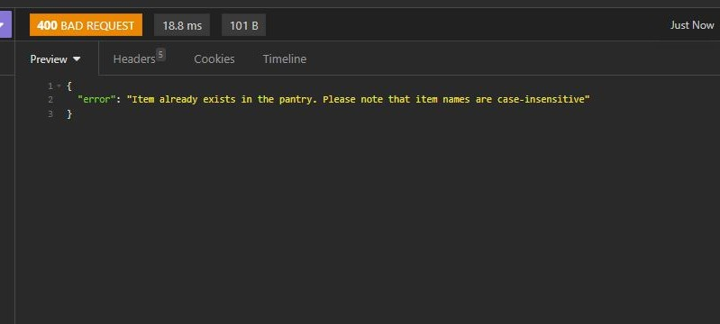<br>
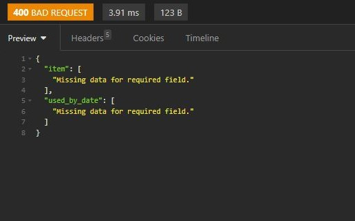<br>
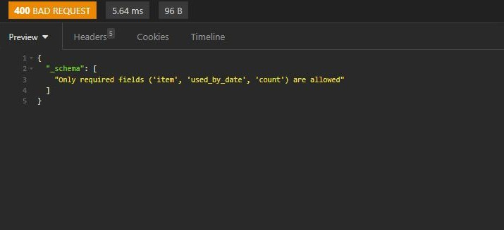<br>
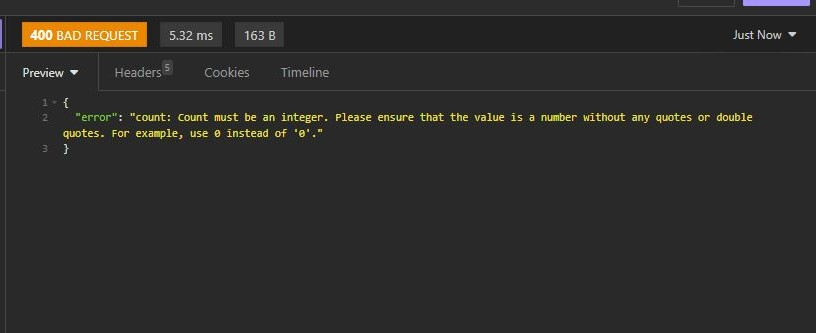<br>
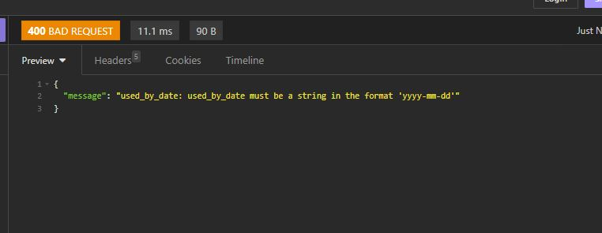<br>
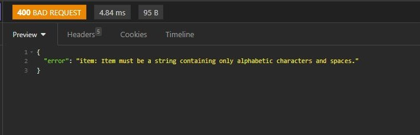<br>
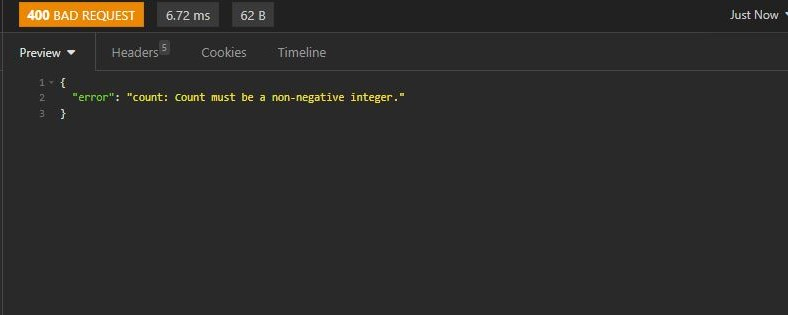<br>
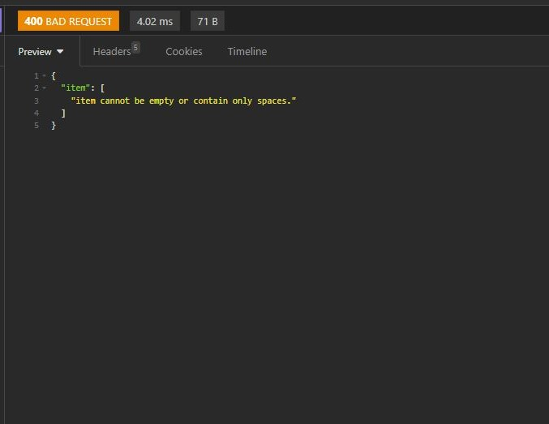<br>
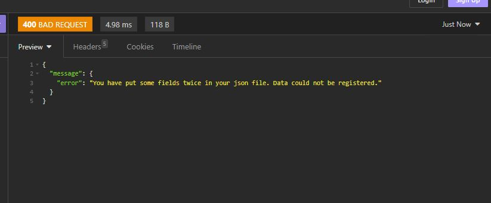


### 4. Deleting item from your pantry
This endpoint is for deleting items from the pantry. When a DELETE request is made to this endpoint with the names of the items to be deleted in the url, it deletes the item from the current user’s pantry. If the item does not exist, it returns a message indicating so.

```
Endpoint: /pantry/<item>
Request Verb: DELETE
Required data: Item
Expected Response: 200 request was successful
Authentication: JWT token must be valid

```


**Expected response** <br>


**Error handling**<br>
<br>


### 5. Updating your item data
This endpoint is for updating  an item in the pantry. When a PUT request is made in the request body, it first check that the item exist in the pantry. if item does indeed exist it validates the new data and updates the item data in the current user’s pantry. If the new data is the same as the old data, it returns a message indicating that the data needs to be different for an update to actually occur.

```
Endpoint: /pantry/<item>
Request Verb: PUT/PATCH
Required data: Item and at least count or used_by_date or both
Expected Response: 200 request was successful
Authentication: JWT token must be valid

```

**Expected Json inputs**

```

    {
			"count": 1,
			"used_by_date":"2023-12-20"
    }
```
```
    {
			"count": 1
    }
```
```
    {
			"used_by_date":"2023-12-20"
    }
```
**Expected response** <br>
<br>

**Error handling**<br>
<br>
<br>
<br>
<br>
<br>

### 6. List all the items that have ran out in your pantry
When a GET request is made to this endpoint, it returns a list of all items in the current user’s pantry that have run out. If there is no item in your pantry whose count is 0, it will return a message to say so.

```
Endpoint: /pantry/itemrunout
Request Verb: GET
Required data:None 
Expected Response: 200 request was successful
Authentication: JWT token must be valid

```

**Expected response** <br>
<br>


### 7.  List Items to be Used Within a Specified Timeframe
This endpoint is designed to help users manage their pantry items more effectively. When a GET request is made to this endpoint with a specified number of days, it returns a list of items that need to be used within that timeframe. This is particularly useful for managing perishable items and reducing food waste. If there are no items to be used in the next specified number of days, it returns a message indicating so.

```
Endpoint: /pantry/itemusedby/<int:days>
Request Verb: GET
Required data: day(s) 
Expected Response: 200 request was successful
Authentication: JWT token must be valid

```

**Expected response** <br>
<br>


### 8. Retrieve Expired Items in the Pantry
This endpoint is for retrieving expired items in the pantry. When a GET request is made to this endpoint, it returns a list of items that have already expired. This feature is crucial for maintaining the quality and safety of the food in the pantry, as consuming expired items can lead to health issues. If there are no expired items, it returns a message indicating so.

```
Endpoint: /pantry/itemexpired
Request Verb: GET
Required data:None 
Expected Response: 200 request was successful
Authentication: JWT token must be valid
```

**Expected response** <br>
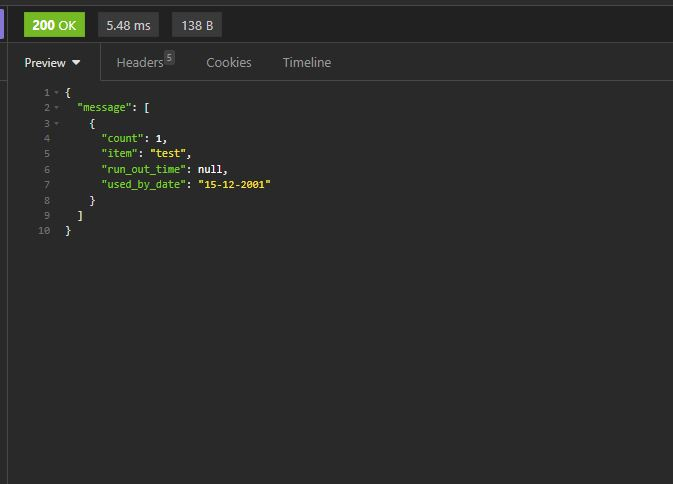<br>


### 9. Register as a user
This endpoint is for registering a new user. When a POST request is made to this endpoint with the user’s details (username, password, email, and security answer) in the request body, it validates the data, checks if the username and email already exist, and if not, creates a new user with the provided details. The password and security answer are hashed before being stored for security reasons. If the user is successfully registered, it returns a success message along with the username and email of the new user. Please note that when a user is created their pantry is also created through an event listener.

```
Endpoint: /users/register
Request Verb: POST
Required data: username, password, email, security_answer
Expected Response: 201 Created success
Authentication: none

```

**Expected Json inputs**
```
{
	"email":"test6@gmail.com",
	"password":"Testtest1!",
	"username": "test4",
	"security_answer": "test"
}

```
**Expected response** <br>


**Error handling**<br>
<br>
<br>
<br>
<br>
<br>
<br>
<br>
<br>
<br>
<br>
<br>
<br>
<br>


### 10. Login 
This endpoint is for logging in a user. When a POST request is made to this endpoint with the username and password in the request body, it checks if the user exists and if the provided password matches the stored password for that user. If the login is successful, it generates an access token for the user and returns a success message.


```
Endpoint: /users/login
Request Verb: POST
Required data: username, password
Expected Response: 200 request was successful
Authentication: JWT token must be valid

```

**Expected Json inputs**

```
{
	   "username": "test2",
		"password": "Testtest1!"
}

```

**Expected response** <br>


**Error handling**<br>
<br>
<br>
<br>


### 11. Logout  
This endpoint is for logging out a user. When a POST request is made to this endpoint, it revokes the access token of the current user, effectively logging them out. If the logout is successful, it returns a success message.

It is important to note that while the server does not maintain any state information between requests, it does store the tokens that have been revoked in a database. This is not a violation of the statelessness principle, as this information is not used to maintain a session state between requests, but rather to prevent the use of revoked tokens if user decide to log out and revoke their token.

```
Endpoint: /users/logout
Request Verb: POST
Required data: JWT token
Expected Response: 200 request was successful
Authentication: JWT token must be valid. You cannot log out and revoke your token if you don't have a token to begin with.

```

**Expected response** <br>


### 12. Forgot password 
This endpoint is for users who have forgotten their password. When a POST request is made to this endpoint with the user’s username and security answer in the request body, it checks if the username exists and if the provided security answer matches the stored security answer for that user. If the security answer is correct, it validates the data and allows the user to set a new password. If the new password is the same as the existing password, it returns an error message. If the new password is successfully set, it returns a success message.

```
Endpoint: /users/forget_password
Request Verb: POST
Required data: username, new_password, confirm_password, security_answer 
Expected Response: 200 request was successful
Authentication: none 

```

**Expected Json inputs**

```
{
    "username": "Test4",
	"confirm_password":"Testtest2!" ,
	"new_password":"Testtest2!",
	"security_answer": "test"
}

```
**Expected response** <br>


**Error handling**<br>
<br>
<br>
<br>
<br>
<br>
<br>


### 13. Reset password 
This endpoint is for authenticated users who want to change their password. When a POST request is made to this endpoint with the old password and new password in the request body, it checks if the old password is correct and if the new password is different from the old password. If the old password is incorrect or the new password is the same as the old password, it returns an error message. If the new password is successfully set after being validated, it returns a success message.

```
Endpoint: /users/reset_password
Request Verb: POST
Required data: new_password, confirm_password, old_password
Expected Response: 200 request was successful
Authentication: JWT token must be valid

```

**Expected Json inputs**

```
{
	"confirm_password":"Testtest2!",
	"new_password":"Testtest2!",
	"old_password":"Testtest1!"

}

```

**Expected response** <br>


**Error handling**<br>
<br>
<br>
<br>
<br>
<br>
<br>


### 14. Reset security_answer 
This endpoint is for authenticated users who want to change their security answer. When a POST request is made to this endpoint with the old security answer and new security answer in the request body, it checks if the old security answer is correct and if the new security answer is different from the old security answer. If the old security answer is incorrect or the new security answer is the same as the old security answer, it returns an error message. If the new security answer is successfully set after being validated, it returns a success message.

```
Endpoint: /users/reset_password
Request Verb: POST
Required data: old_security_answer, new_security_answer, confirm_security_answer
Expected Response: 200 request was successful
Authentication: JWT token must be valid

```

**Expected Json inputs**

```
{
	"confirm_security_answer":"testtest",
	"new_security_answer":"testtest" ,
	"old_security_answer":"test"
}


```

**Expected response** <br>


**Error handling**<br>
<br>
<br>
<br>
<br>
<br>


## ERD 

 <br>


USER ||--|| PANTRY :  means that one USER has exactly one PANTRY. In other words, a user can have only one pantry. <br>
PANTRY ||--o{ PANTRYITEM : contains means that one PANTRY can contain zero or multiple PANTRYITEM. However each PANTRYITEM belongs to exactly one PANTRY. 

## Describe project's models in terms of the relationships they have with each other

**User Model** 
```
    id = db.Column(db.Integer, primary_key=True)
    username = db.Column(db.Text(), unique=True, nullable=False) 
    password_hash = db.Column(db.Text(), nullable=False)
    email = db.Column(db.String(320), unique=True, nullable=False) 
    security_question = db.Column(db.Text(), nullable=False)
    security_answer = db.Column(db.Text(), nullable=False) 
    pantry = db.relationship('Pantry', back_populates='user', uselist=False)
```
The line pantry = db.relationship('Pantry', back_populates='user', uselist=False) establishes a one-to-one relationship between the User model and the Pantry model. This relationship is enforced at the application level by SQLAlchemy

Here’s how it works:

- 'Pantry' is the name of the other model class. SQLAlchemy will use this to link the User model to the Pantry model.
- back_populates='user' means that the Pantry model will have a user attribute, which will provide access to the related User object.
- uselist=False is what makes this relationship one-to-one instead of one-to-many (which is the default). When uselist is False, SQLAlchemy knows that each User object can only be associated with one Pantry object. 

**Pantry Model**
```
    pantry_id = db.Column(db.Integer, primary_key=True)
    user_id = db.Column(db.Integer, db.ForeignKey('users.id'), unique=True)
    name = db.Column(db.Text(), nullable=False)
    user = db.relationship('User', back_populates='pantry')
    items = db.relationship('PantryItem', back_populates='pantry')
```

- user_id = db.Column(db.Integer, db.ForeignKey('users.id'), unique=True): This line establishes a foreign key relationship with the User model. The user_id column in the Pantry table will store the id of the User that the pantry belongs to. The unique=True argument ensures that each Pantry can only be associated with one User. This one-to-one relationship is enforced at the database level by the unique constraint on the user_id column.
- user = db.relationship('User', back_populates='pantry'): This line establishes a one-to-one relationship with the User model. The User model will have a pantry attribute, which will provide access to the related Pantry object. This is the other side of the relationship that was established in the User model with pantry = db.relationship('Pantry', back_populates='user', uselist=False).
- items = db.relationship('PantryItem', back_populates='pantry'): This line establishes a one-to-many relationship with a PantryItem model. Each Pantry can have multiple PantryItem objects, which are accessible through the items attribute. The PantryItem model would have a pantry attribute, which provides access to the related Pantry object. This is enforced at the application level by SQLAlchemy


**PantryItem Model** 

```
    item_id = db.Column(db.Integer, primary_key=True)
    pantry_id = db.Column(db.Integer, db.ForeignKey('pantries.pantry_id'))
    item = db.Column(db.Text(), nullable=False)
    used_by_date = db.Column(db.Text(), nullable=False)  
    count = db.Column(db.Integer, nullable=False)
    run_out_time = db.Column(db.DateTime, nullable=True)
    pantry = db.relationship('Pantry', back_populates='items')
```

- pantry_id = db.Column(db.Integer, db.ForeignKey('pantries.pantry_id')): This line establishes a foreign key relationship with the Pantry model.This means that the value of pantry_id in the PantryItem table must match the value of pantry_id in some row of the Pantry table.So, each PantryItem is associated with exactly one Pantry. This is enforced at the database level. Please note that if we set unique=True for pantry_id in the PantryItem model, it would mean that each Pantry could only have one PantryItem, which is not what we want.
- pantry = db.relationship('Pantry', back_populates='items'): This line establishes a many-to-one relationship with the Pantry model. The Pantry model will have an items attribute, which will provide access to the list of related PantryItem objects. This is the other side of the relationship that was established in the Pantry model with items = db.relationship('PantryItem', back_populates='pantry'). This is enforced at the application level by SQLAlchemy.


## Discuss the database relations to be implemented in your application

 The project uses a relational database, which means that data is organized into tables (in this case, User, Pantry, and PantryItem), and relationships between these tables are established through foreign keys. Here’s a further explanation of how the relationships are implemented and used in the project.

Foreign keys relationship implementation: <br>
- User-Pantry Relationship: This is a one-to-one relationship. Each User has exactly one Pantry, and each Pantry belongs to exactly one User. This relationship is established through the user_id foreign key in the Pantry mode, which references the id primary key in the User model.
- Pantry-PantryItem Relationship: This is a one-to-many relationship. Each Pantry can have multiple PantryItems, but each PantryItem belongs to exactly one Pantry. This relationship is established through the pantry_id foreign key in the PantryItem model, which references the pantry_id primary key in the Pantry model.

Additionally, back-population is a feature provided by SQLAlchemy that allows for two-way navigation of relationships. <br>

Back-population implementation:<br>
- User-Pantry Back-Population: In the User model, the pantry field is a relationship to the Pantry model, and back_populates='user' tells SQLAlchemy to keep the user field of the Pantry model in sync with the pantry field of the User model. This means that if you have a User instance , you can access the user’s pantry with user.pantry, and if you have the Pantry instance that’s associated with the user, you can access the user of the pantry with pantry.user.
- Pantry-User Back-Population: In the Pantry model, the user field is a relationship to the User model, and back_populates='pantry' tells SQLAlchemy to keep the pantry field of the User model in sync with the user field of the Pantry model. This is the other side of the User-Pantry relationship described above.
- Pantry-PantryItem Back-Population: In the Pantry model, the items field is a relationship to the PantryItem model, and back_populates='pantry' tells SQLAlchemy to keep the pantry field of the PantryItem model in sync with the items field of the Pantry model. This means that if you have a Pantry instance, you can access the items in the pantry with pantry.items, and if you have a PantryItem instance  that’s associated with pantry, you can access the pantry of the item with pantryitem.pantry.
- PantryItem-Pantry Back-Population: In the PantryItem model, the pantry field is a relationship to the Pantry model, and back_populates='items' tells SQLAlchemy to keep the items field of the Pantry model in sync with the pantry field of the PantryItem model. This is the other side of the Pantry-PantryItem relationship described above.

These back-populations allow for two-way navigation of the relationships between the models, greatly simplifying querying. <br>
Lastly, an Event Listener is set up to trigger after a new User record is inserted into the database. This listener automatically creates a new Pantry object associated with the newly created User. The pantry’s name is set to a string that includes the username of the User. It also ensures that every user has a pantry as soon as they are created, helping the success of establishing that one-to-one relationship automatically.

## Detail any third party services that your app used. 

- flask: Written in Python, Flask stands as a micro web framework; its design aids developers in constructing secure—scalable—and maintainable web applications.The Flask library facilitates the creation of routes; it equips developers with endpoint definition capabilities and management tools for handling HTTP requests/responses.
- flask_sqlalchemy: an extension for Flask, enhances your application with SQLAlchemy support. It streamlines the process of integrating SQLAlchemy into Flask by offering pragmatic defaults and supplementary helpers that facilitate routine tasks. By mapping Python classes to database tables through schemas, it simplifies database operations. The system presents a Pythonic interface at an advanced level, facilitating the creation of your database, executing queries and manipulating data through SQL commands.
- flask_bcrypt: PFlask-Bcrypt is a Flask extension that provides bcrypt hashing utilities for your application. Bcrypt is an advanced password hashing algorithm that is particularly strong against brute force attacks.
- flask_jwt_extended: The extension 'flask_jwt_extended' injects JSON Web Token (JWT) support into your Flask application. JWTs, a secure information transmission method between parties, typically handle user authentication and authorization due to their reliability: digital signing renders this data verifiable and trustworthy
- flask_marshmallow: TThe flask_marshmallow extension integrates Marshmallow into Flask; it's a versatile library: an ORM/ODM/framework-agnostic tool that simplifies the serialization and deserialization of complex data types such as objects to Python data structures. This proves particularly valuable in API development where you often require sending or receiving data in Json format.
- marshmallow: Marshmallow, a lightweight library, it converts complex datatypes to and from Python data types; primarily used for object serialization/deserialization. It proficiently handles nested fields, collections and complex object structures: through this versatile tool you can easily render and validate JSON responses in your Flask routes using Marshmallow schemas.
- dotenv: module enables the specification of environment variables in conventional UNIX-like ".env" files. Often, environment variables store sensitive information: API keys; database credentials; and other configuration settings that should not be hardcoded into the source code of an application. Exposing or sharing this source code can potentially lead to security vulnerabilities when such information is hard-coded.

## Describe the way tasks are allocated and tracked in your project.A software development plan

For this project, I chose to use the Kanban system as a visual tool for managing my work. I used Trello as my Kanban system. This system helped me identify potential bottlenecks in my process and address them to maintain a smooth workflow. I organized my work into three stages: To Do, In Progress, and Done. As I completed tasks, I moved them from one stage to the next.

In the beginning, each card in the To Do stage had only basic heading. Unless I was going to do the card in the next day or two, most of them didn't have a checklist. This approach gave me the flexibility to start with a high-level plan and then add more detailed steps as I progressed and coded more. It also allowed me to include additional tasks that I wouldn't anticipated at the start. Once I finished writing a checklist for a card, I moved the card to the In Progress stage and started working on the tasks. As I completed each task, I checked it off the checklist. Once all tasks on a card were completed, I moved the card to the Done stage. I repeated this process until all cards were in the Done stage.

I also monitored my project progress through daily Stand-up meetings. These meetings provided an opportunity for me to share updates on the tasks I had listed in my Trello board, as well as discuss my current status. I could also bring up any challenges I was facing and discuss my future plans. This practice served as a self-check mechanism, helping me stay accountable and keep track of my progress.


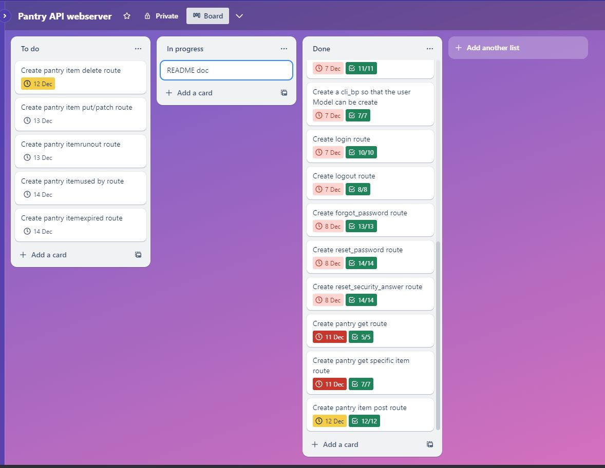


## References 

Foodbank Australia. (n.d.). Food waste facts in Australia.
Available at: 
 https://www.foodbank.org.au/food-waste-facts-in-australia/?state=vic

ABC News. (2023, August 14). Food inflation: Are food prices going to go down? 
Available at: https://www.abc.net.au/news/2023-08-14/food-inflation-are-food-prices-going-to-go-down/1026692

ASC Consultants. (n.d.). The science behind food expiry dates. 
Available at: 
https://ascconsultants.co.za/the-science-behind-food-expiry-dates

Panchenko, I. (2021). PostgreSQL benefits and challenges: A snapshot.InfoWorld. 
Available at: https://www.infoworld.com/article/3619531/postgresql-benefits-and-challenges-a-snapshot.html

Bytebase. (2023a). Postgres vs. MongoDB: a Complete Comparison in 2023. 
Available at: https://www.bytebase.com/blog/postgres-vs-mongodb/ [Accessed 13 Dec. 2023].

Bytebase. (2023b). Postgres vs. MySQL: a Complete Comparison in 2023.
Available at: https://www.bytebase.com/blog/postgres-vs-mysql/#:~:text=Range%20Units%3A%20MySQL%20only%20supports [Accessed 13 Dec. 2023].

Joy, A. (n.d.). Introduction to ORM with Flask-SQLAlchemy.Pythonista Planet. 
Available at: https://pythonistaplanet.com/flask-sqlalchemy/ [Accessed 13 Dec. 2023].

Turso Blog. (2023). When to choose an ORM for your Database. 
 Available at: https://blog.turso.tech/when-to-choose-an-orm-for-your-database-11a05b42 [Accessed 13 Dec. 2023].
 
www2.sqlite.org. (n.d.). SQLite CVSTrac. 
Available at: https://www2.sqlite.org/cvstrac/wiki?p=WhenToUseSqlite#:~:text=The%20basic%20rule%20of%20thumb [Accessed 13 Dec. 2023].


